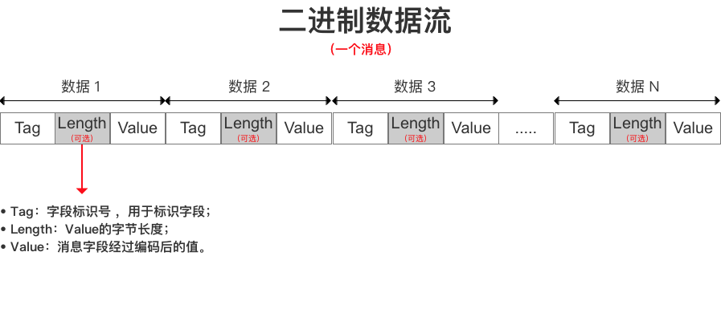

## 自定义协议的序列化和反序列化
这里主要是实现了自定义协议的一个序列化为byte数组和从byte数组反序列化出来。
像json，pb这些数据格式的序列化和反序列化都是通过一个反射的方法去处理，这样的好处是能动态处理，不需要每个协议都得手动实现序列化和反序列化的方法，但反射从速度来说肯定是比不上硬编码的形式，所以这里的核心思想就是通过代码生成硬编码的的序列化和反序列化方法
实现思路：
1. 提前预写好基础类型（int,string等）的序列化和反序列化的方法，该实现在```util/convert.go```里
2. 定义个所有协议必须实现的接口才允许注册进协议列表中，接口包含以下方法: marshal, unmarshal, setField, newMessage, getMessageId
3. 通过ast解析代码源文件，拿到所有定义的协议结构体，并解析每一个结构体是否有打了```msg_tag```标识 解析其中相关的内容
4. 根据ast解析出来的tag标识内容，拿到字段tag，字段类型定义和驼峰命名映射的字段名称，匹配到对应的代码模版文件，进去生成该协议实现接口的代码，并创建和写入到```msg_auto_gen.go```的文件中，注意，该文件最好不要手动编辑
5. 生成完后根据本地起步的自增变量开始逐步递增的规则来分配msg id，支持从环境变量中设置该值的起始值

生成的二进制数组的定义结构图如下：
主要包含四大模块：(msg_id) (field_id field_value_length field_value) ... (field_id field_value_length field_value) ...



### msg_marshal_gen 使用方法如下：
1、在文件头部添加自动工具运行
如
```
//go:generate go run go_study/custom_protocol/msg_general $GOFILE
```

2、在需要生成序列化和反序列的结构体和对应的字段补充 tag，tag内容格式如下：
```
`msg_tag:"uint32,1,id"`
tag名称固定为：msg_tag
tag内容分别为：
1，字段类型 支持基础类型，slice，map和struct
2，字段tag标识号 该标识号需要保持唯一 只支持正整数
3，字段驼峰命名原始的字段名称 注意这里一定要命名规范 后续需要跟它来映射回原始字段名称
```
示例如下：
```go
type Message struct {
	Id      uint32  `msg_tag:"uint32,1,id"`
	Name    string  `msg_tag:"string,2,name"`
	Coins   float32 `msg_tag:"float32,3,coins"`
	Damoind float64 `msg_tag:"float64,4,damoind"`
}
```

3、支持从环境变量设置msg id起始的自增值，会逐步递增上去，环境变量名称：```GENERATE_MESSAGE_INCR_START_VALUE```